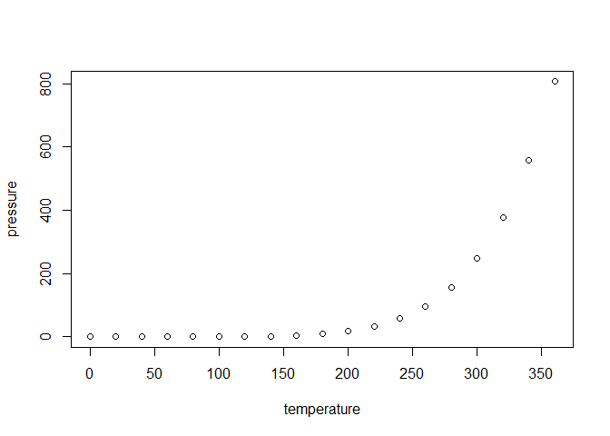

<!-- README.md is generated from README.Rmd. Please edit that file -->

# spellbook

<!-- badges: start -->

<!-- badges: end -->

*A whimsical R package of reusable incantations* ✨

The spellbook package is a personal library of functions, ggplot2
themes, and palettes that I reach for often in data analysis and
visualization. Instead of re-writing code across projects, I can now
summon my favorite utilities directly from this grimoire.

Features

Handy utility functions for everyday analysis 🧹

Custom ggplot2 themes (e.g. theme_parchment) styled with personality 📜

Color palettes and styling tools for consistent plots 🎨

Easy to expand as new “spells” are discovered ✍️

## Installation

You can install the development version of spellbook from
[GitHub](https://github.com/) with:

``` r
devtools::install_github("colebaril/spellbook")
```

## Example

This is a basic example which shows you how to solve a common problem:

``` r
library(spellbook)
## basic example code
```

What is special about using `README.Rmd` instead of just `README.md`?
You can include R chunks like so:

``` r
summary(cars)
#>      speed           dist       
#>  Min.   : 4.0   Min.   :  2.00  
#>  1st Qu.:12.0   1st Qu.: 26.00  
#>  Median :15.0   Median : 36.00  
#>  Mean   :15.4   Mean   : 42.98  
#>  3rd Qu.:19.0   3rd Qu.: 56.00  
#>  Max.   :25.0   Max.   :120.00
```

You’ll still need to render `README.Rmd` regularly, to keep `README.md`
up-to-date. `devtools::build_readme()` is handy for this.

You can also embed plots, for example:



In that case, don’t forget to commit and push the resulting figure
files, so they display on GitHub and CRAN.
