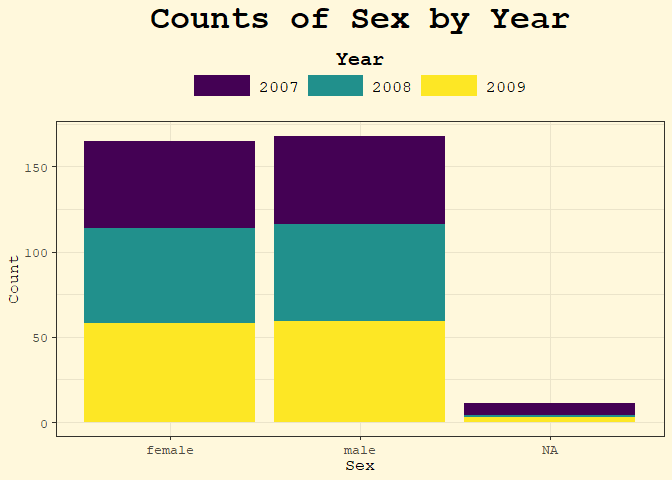

<!-- README.md is generated from README.Rmd. Please edit that file -->

# spellbook

<!-- badges: start -->

<!-- badges: end -->

*A whimsical R package of reusable incantations* ✨

The spellbook package is a personal library of functions, ggplot2
themes, and palettes that I reach for often in data analysis and
visualization. Instead of re-writing code across projects, I can now
summon my favorite utilities directly from this grimoire.

## Features

- Handy utility functions for everyday analysis 🧹

- Custom ggplot2 themes (e.g. theme_parchment) styled with personality
  📜

- Color palettes and styling tools for consistent plots 🎨

- Easy to expand as new “spells” are discovered ✍️

## Installation

You can install the development version of spellbook from
[GitHub](https://github.com/) with:

``` r
devtools::install_github("colebaril/spellbook")
```

## Example

In the following example, `theme_parchment()` is used to alter thematic
elements of the plot and `scale_spellbook()` is used to apply my custom
colour palettes.

``` r
library(spellbook)
library(tidyverse)
library(palmerpenguins)
library(extrafont)


ggplot(penguins, aes(flipper_length_mm, bill_length_mm, fill = species, group = species)) +
  geom_point(shape = 21) +
  geom_smooth(aes(colour = species), se = FALSE, method = "lm") +
  scale_spellbook(name = "Species", palette = "arcane_flame", type = "d", aesthetics = "fill") +
  scale_spellbook(name = "Species", palette = "arcane_flame", type = "d", aesthetics = "colour") +
  theme_parchment() +
  labs(title = "Palmer Penguin Bill Length \nvs. Flipper Length", x = "Flipper Length (mm)", y = "Bill Length (mm)")
```


