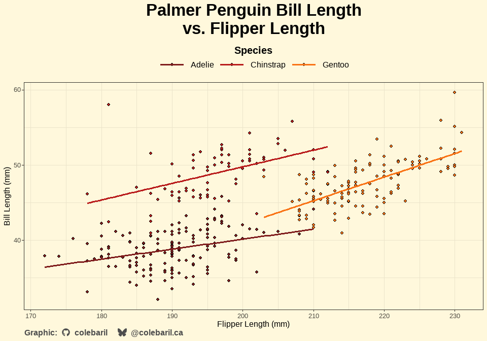

<!-- README.md is generated from README.Rmd. Please edit that file -->

# spellbook

<!-- badges: start -->

<!-- badges: end -->

*A whimsical R package of reusable incantations* ✨

The spellbook package is a personal library of functions, ggplot2
themes, and palettes that I reach for often in data analysis and
visualization. Instead of re-writing code across projects, I can now
summon my favorite utilities directly from this grimoire.

## Features

- Handy utility functions for everyday analysis 🧹

- Custom ggplot2 themes (e.g. theme_parchment) styled with personality
  📜

- Color palettes and styling tools for consistent plots 🎨

- Easy to expand as new “spells” are discovered ✍️

## Installation

You can install the development version of spellbook from
[GitHub](https://github.com/) with:

``` r
devtools::install_github("colebaril/spellbook")
```

## Example

### Themes and Palettes

In the following example, `theme_parchment()` is used to alter thematic
elements of the plot and `scale_spellbook()` is used to apply my custom
colour palettes.

``` r
library(spellbook)
library(tidyverse)
library(palmerpenguins)
library(extrafont)


ggplot(penguins, aes(flipper_length_mm, bill_length_mm, fill = species, group = species)) +
  geom_point(shape = 21) +
  geom_smooth(aes(colour = species), se = FALSE, method = "lm") +
  scale_spellbook(name = "Species", palette = "arcane_flame", type = "d", aesthetics = "fill") +
  scale_spellbook(name = "Species", palette = "arcane_flame", type = "d", aesthetics = "colour") +
  theme_parchment() +
  labs(title = "Palmer Penguin Bill Length \nvs. Flipper Length", x = "Flipper Length (mm)", y = "Bill Length (mm)")
```



### Data Cleaning

In this example, `purify_data()` is used to standardize column names,
trim white space, convert empty columns to true `NA`s, and flags
outliers for any numeric columns using robust means.

``` r
df <- tibble::tibble(
  "First Name" = c(" Alice ", "Bob", "", "CHARLIE", "dave", "Eve", NA, "Bob", "Bob"),
  "Last Name" = c("Smith", "Jones", "O'Neil", "Brown", "Miller", "O'Brien", "", "Jones", "Jones"),
  "Score" = c(10, 5000, 15, 20, 12, -999, 14, 5000, 5000),  # includes outlier
  "Enrollment Date" = c("2025-01-01", "20241215", "2025/02/01", "", NA, "01-03-2025", "2025-01-01", "2024-12-15", "2024-12-15"),
  "Grade" = c("A", "b", "C", "A", "B", "", "A", "b", "b"),
  "Comments!" = c("Good", " Excellent ", "", "Needs work", NA, "Good!", "Average", " Excellent ", " Excellent "),
  "EmptyCol" = c(NA, NA, NA, NA, NA, NA, NA, NA, NA)
)

print(df)
#> # A tibble: 9 × 7
#>   `First Name` `Last Name` Score `Enrollment Date` Grade `Comments!`   EmptyCol
#>   <chr>        <chr>       <dbl> <chr>             <chr> <chr>         <lgl>   
#> 1 " Alice "    "Smith"        10 "2025-01-01"      "A"   "Good"        NA      
#> 2 "Bob"        "Jones"      5000 "20241215"        "b"   " Excellent " NA      
#> 3 ""           "O'Neil"       15 "2025/02/01"      "C"   ""            NA      
#> 4 "CHARLIE"    "Brown"        20 ""                "A"   "Needs work"  NA      
#> 5 "dave"       "Miller"       12  <NA>             "B"    <NA>         NA      
#> 6 "Eve"        "O'Brien"    -999 "01-03-2025"      ""    "Good!"       NA      
#> 7  <NA>        ""             14 "2025-01-01"      "A"   "Average"     NA      
#> 8 "Bob"        "Jones"      5000 "2024-12-15"      "b"   " Excellent " NA      
#> 9 "Bob"        "Jones"      5000 "2024-12-15"      "b"   " Excellent " NA

purify_data(df, trim_chars = TRUE, empty_to_na = TRUE, flag_outliers = TRUE)
#> # A tibble: 8 × 8
#>   first_name last_name score enrollment_date grade comments   empty_col
#>   <chr>      <chr>     <dbl> <chr>           <chr> <chr>      <lgl>    
#> 1 Alice      Smith        10 2025-01-01      A     Good       NA       
#> 2 Bob        Jones      5000 20241215        b     Excellent  NA       
#> 3 <NA>       O'Neil       15 2025/02/01      C     <NA>       NA       
#> 4 CHARLIE    Brown        20 <NA>            A     Needs work NA       
#> 5 dave       Miller       12 <NA>            B     <NA>       NA       
#> 6 Eve        O'Brien    -999 01-03-2025      <NA>  Good!      NA       
#> 7 <NA>       <NA>         14 2025-01-01      A     Average    NA       
#> 8 Bob        Jones      5000 2024-12-15      b     Excellent  NA       
#> # ℹ 1 more variable: score_outlier_flag <lgl>
```
